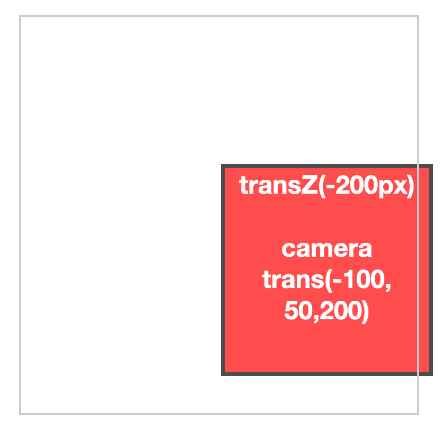
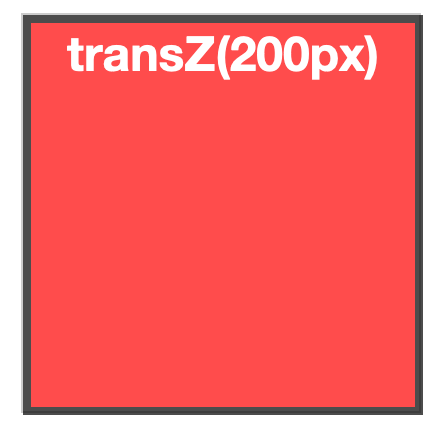
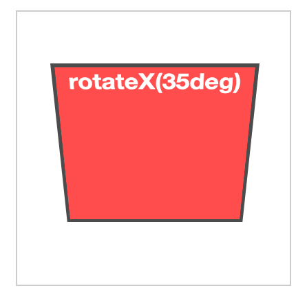
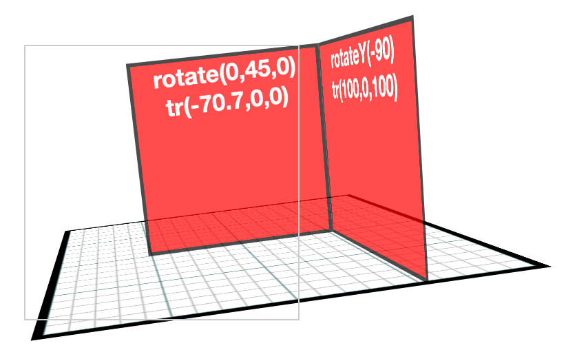
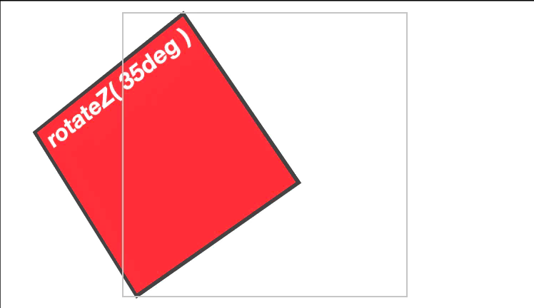

# Assignment 1: Scene Graph and Animated Story

In this assignment, you will create a simple scene graph to transform HTML elements in 3D space,
using CSS3 transforms, and then create an animated story using a scene of DOM elements positioned in a 3D space.

## Due: Thursday Sept 12th, 11:59pm

## Author

**Name:  PLEASE PUT YOUR NAME HERE**

## Overview 

The assignment requires you to do three things:

1. Implement the scene graph library defined in src/SG.ts.  A number of the classes are partially defined, mostly providing an interface that you must implement.  
2. Use the scene graph to create a simple "character" out of a hierarchy of 2D images (described further below), 
3. Create an animated story using that character.

The assignment will be graded out of 30;  each of the three parts of the assignment are worth equal amounts (10 points each).

You should submit your project using github classroom.  All of the code for the scene graph should be in src/SG.ts, and your simple animated character scene should be in new index.html and src/app.ts files.  The tsconfig.json should be updated to include this new src/app.ts;  the TAs should be able to compile your files by running the ```tsc``` command and then open index.html to see your animated character.

## The Scene Graph
The graph's ```render()``` method will compute all of the transformations on the tree of "Things" (graph nodes), 
and use it to set the full transformation on each HTML element in the graph;  you will **NOT** use any CSS 3D hierarchy for the elements.  

You will create a module in src/SG.ts that implements a scene graph.  A skeleton of src/SG.ts is provided.

The sample code also includes an example program (ex1.html and src/ex1.ts) that uses src/SG.ts to render a set of five simple
scenes:

- single div, translated -200 in z, camera translated by (-100,50,200)



- single div, translated 200 in z so it fills the view



- single div, rotated by 35 degrees around X



- two divs, transformed to be 90 degrees rotated on an edge, with a camera rotation, and a simple ground plane under the two divs



- single div, rotating, with camera rotating as well



## Details

We have provided a sample program to test your src/SG.ts module, src/ex1.ts and ex1.html.  You can use this as a first set of tests;  once ex1.html matches the images above, your src/SG.ts probably works:  we will not, of course, guarantee that it works because the tests in ex1 are very simple (very few objects, very little depth to the graph).  You will need to test these yourself.

The second part of the assignment is to create a hierarchical character and a small 3D story using it.

### Hierarchical Character

Here are the required elements for your main character:
1. Your object should be something recognizable, and not some abstract or random set of images/DOM elements. You should arrange a set of DOM elements with colors, gradients or image backgrounds such that the character looks like something recognizable (and appropriate for a class project).
2. Use at least ten different sub-parts to make your object.  Each of the parts should have a different image or color on it.
3. Most or all of the sub-parts of your object should be touching or overlapping each other.
4. The scene graph for your character should have at least 3 levels (e.g., body, head, lower-jaw).
5. Make use of all three basic transformations to assemble your object (rotate, scale, translate).
6. ALL transformations on the DIVs **MUST** be done with the scene graph, aside from setting the DIV size in pixels when you create each DIV. You should not change the origin (i.e., it's position should be the center of the DIV) or move it in any way. 

Be creative: any DOM element can be positioned in 3D using CSS3 transforms (including videos, elements decorated with complex CSS decorations, and so on). Each element is a single DIV, but can contain any number of DIVs within it.  It could be an image, a movie, or a mixture of an image or a movie and some text.

### Animated Story

The goal of this part of the assignment is to use transforms that change through time to create an animated scene.  This scene should tell a story of some form.  The story can be very simple, but should somehow introduce your character, have your character carry out an action, and then resolve the scene.

You will most likely want to create more things to populate your scene, but these new objects can be more simple than the main character; they could be as simple as a single DIV with a picture or text in them. Your main goal for this part of the assignment will be to make one or more of the objects in the scene move, and to also move the virtual camera through the scene. 

Below is a checklist of elements that you must include in your scene:
1. Camera Motion. You should move the camera smoothly through the scene, rather than keeping it in one place. Just rotating the entire scene does not count as moving the camera;  it should move rotate to keep the important objects in view. Please note that having the user press keys or move the mouse to control the camera does not count towards automatic motion of the camera. 
2. Hierarchical Character. You must include your character in the scene somewhere.
3. Object Animation. Include at least two object motions in the scene (distinct from the camera motion). One of these motions should transform part of your hierarchical character, the other should transform one of the other scene objects.  Make sure it is clear that these objects are moving, and not just changing their apparent positions due to camera motion.  All animation **MUST** be done using the scene graph;  you are not allowed to change the CSS properties of your DIVs after they are initialized and added to the scene graph. 
4. Duration.  Your animation should create more than 300 frames of images. Please create an animation that finishes in a reasonable amount of time on your computer.

You will probably want to use a “time” variable to help control motion of your objects.  "time" could count frames, or it could be based on clock time, as you prefer.  

In addition to changing the transform of objects based on time, you can add and remove scene graph elements over time as well. 

Pay attention to the size of any images you include:  keep them reasonable (e.g., under 1000 pixels width and height) so that the project is not excessively big. 

For this assignment, you are **NOT** allowed to use any of the CSS3 transformation animation functions;  rather, you must implement the animations in code with your scene graph and requestAnimationFrame.  

## Submission

You will check out the project from github classroom, and submit it there.  The project folder should contain the files that were in the sample project, plus any additions to the sample project that are needed to implement the project.  Do not add extra files, and do not remove the .gitignore file (we do not want the "node_modules" directory in your repository.)

**Do Not Change the names** of the existing files (e.g., ex1.html, src/SG.ts, etc).  The TAs need to be able to test your program as follows:

1. cd into the directory and run ```npm install```
2. compile with ```tsc```
3. start a local web server in your directory (see below) and visit ```index.html```

Please test that your submission meets these requirements.  For example, after you check in your final version of the assignment to github, check it out again to a new directory and make sure everything builds and runs correctly.
 
# Development Environment

The sample has already been set up with a complete project for Typescript development, similar to the Assignment 0.  Please continue to use whatever setup works best for you.  
